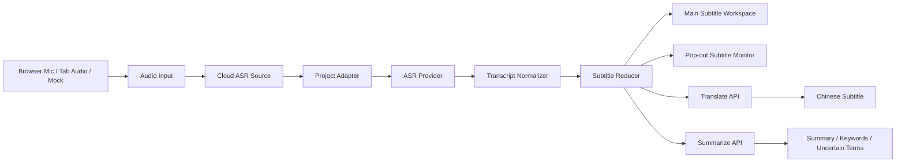

# 00Unit

## Demo

演示视频：()

一个面向实时字幕场景的工作台原型。  
它把浏览器音频输入、云端语音识别、双语字幕和会后总结串成了一条可以实际跑起来的链路，重点不在“做一个界面”，而在“把真实流程接通”。

---

## 项目简介

这个项目最初想解决的问题很直接：

当用户在浏览器里听英文视频、公开课、播客或者会议内容时，能不能用一套相对清晰的架构，把音频接进实时 ASR，再把识别结果转成可读的中英字幕，最后补一个手动触发的总结能力。

所以这里没有把重点放在复杂的业务系统上，而是集中做三件事：

- 让真实输入能接进来
- 让字幕链路稳定跑起来
- 让后续扩展 provider、模型和输入方式时不至于推倒重来

---

## 目前已经具备的能力

### 输入模式

- `Mock`
  - 用于演示和回归测试
- `Cloud ASR (Mic)`
  - 通过浏览器麦克风采集语音
- `Cloud ASR (Tab Audio)`
  - 通过浏览器标签页共享音频采集网页内部播放内容

### 实时字幕

- 实时接收 ASR 结果
- 管理 `draft / final / corrected` 三种字幕状态
- 主界面保留最近两句字幕，方便阅读
- 当前活跃句支持预翻译，final 后再收口
- 正式翻译请求串行处理，避免后一句把前一句打断

### 会后总结

- `summary / keywords / uncertainTerms` 通过手动触发生成
- 与实时字幕链路分开，避免总结任务拖慢实时体验

### 独立字幕窗

- 支持从工作台弹出一个单独的字幕窗口
- 更适合一边播放内容、一边看字幕的使用方式

---

## 为什么这样设计

这个项目没有直接把浏览器前端绑死在某一个 ASR 服务上，而是中间加了一层项目自己的 adapter。这样做的原因很简单：

- 浏览器输入层只需要负责拿到音频
- adapter 负责桥接浏览器和 provider
- provider 层负责和具体语音识别服务通信
- 字幕、翻译、总结则继续走自己的状态流

这样拆开之后，几个好处会比较明显：

- 以后换 ASR provider，前端不需要重写
- 翻译和总结模型可以单独替换
- 调试时更容易判断问题是在输入、识别还是下游处理


---

## 架构概览



---

## 目录结构

```text
app/
  api/
    summarize/               # 总结接口
    translate/               # 翻译接口
  subtitle-monitor/          # 独立字幕窗
  page.tsx                   # 工作台首页

components/
  control-bar.tsx            # 控制区
  source-status.tsx          # 输入状态与诊断信息
  subtitle-workspace.tsx     # 主字幕区
  summary-panel.tsx          # 会后总结区
  workbench-client.tsx       # 前端主工作流

lib/
  asr/                       # ASR source / provider / adapter
  audio/                     # 浏览器音频输入
  llm/                       # 翻译与总结调用
  schemas/                   # zod schema
  source/                    # mock transcript source
  subtitle/                  # reducer / selector / monitor channel

scripts/
  cloud-asr-adapter-server.ts # 本地 adapter 启动脚本
```

---

## 技术栈

- Next.js 15
- React 19
- TypeScript
- Zod
- WebSocket
- Vitest + Testing Library

---

## 快速开始

### 1. 安装依赖

```bash
npm install
```

### 2. 配置环境变量

在项目根目录创建 `.env.local`：

```env
# ===== Cloud ASR adapter =====
CLOUD_ASR_PROVIDER=aliyun-funasr
CLOUD_ASR_ADAPTER_PORT=3210
CLOUD_ASR_ADAPTER_PATH=/cloud-asr-adapter
NEXT_PUBLIC_CLOUD_ASR_ADAPTER_URL=ws://127.0.0.1:3210/cloud-asr-adapter

# ===== Aliyun realtime ASR =====
DASHSCOPE_API_KEY=your_dashscope_api_key
ALIYUN_FUNASR_MODEL=fun-asr-realtime-2026-02-28
ALIYUN_FUNASR_LANGUAGE_HINT=en
ALIYUN_FUNASR_WEBSOCKET_URL=wss://dashscope.aliyuncs.com/api-ws/v1/inference
ALIYUN_FUNASR_SEMANTIC_PUNCTUATION_ENABLED=false
ALIYUN_FUNASR_MAX_SENTENCE_SILENCE=700
ALIYUN_FUNASR_MULTI_THRESHOLD_MODE_ENABLED=true

# ===== LLM for translate + summarize =====
LLM_API_KEY=your_llm_api_key
LLM_BASE_URL=https://dashscope.aliyuncs.com/compatible-mode/v1
LLM_TRANSLATE_MODEL=qwen-mt-turbo
LLM_SUMMARIZE_MODEL=qwen3.7-max
```

说明：

- `.env.local` 已被 `.gitignore` 忽略，不会提交到仓库
- 翻译模型建议优先使用 `qwen-mt-*`
- 总结模型建议用相对强一点的 chat 模型

### 3. 启动本地 adapter

```bash
npm run cloud-asr:adapter
```

正常情况下会看到：

```bash
Project cloud-asr adapter listening on ws://localhost:3210/cloud-asr-adapter
```

### 4. 启动前端

```bash
npm run dev
```

打开：

```text
http://localhost:3000
```


---

## 测试

```bash
npm run test
npm run build
```

当前已经覆盖的内容包括：

- ASR provider 消息映射
- adapter session / server
- 浏览器音频输入
- subtitle reducer
- translate / summarize route
- 页面级工作流和独立字幕窗行为

---

### 已完成

- Mock / Mic / Tab Audio 三种输入模式
- 项目自有 Cloud ASR adapter
- Aliyun FunASR 实时识别接入
- 实时字幕状态管理
- 预翻译 + 正式翻译
- 手动总结
- 独立弹出字幕窗

---

## 后续可扩展内容

- 扩展更多 ASR provider
- 做系统音频输入
- 把独立字幕窗升级成更成熟的悬浮体验
- 增加总结结果持久化
- 做更细粒度的断句和翻译策略
- 浏览器扩展形态
- 直接把字幕注入任意第三方网页
- 用户配置持久化
- 更完整的总结历史管理
